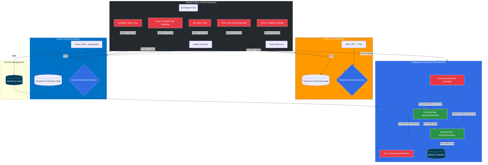

# DevSecOps Capstone Project

This repository contains an intentionally **insecure** cloud-native application and infrastructure setup designed for DevSecOps practice. The goal is to identify, scan, and mitigate vulnerabilities across the entire application lifecycle—from source code to cloud infrastructure.

**⚠️ WARNING: Do not deploy this application or infrastructure to a production environment. It contains severe intentional security flaws.**

## Architecture & Workflow Overview

This diagram represents the hardened, production-ready state of the project after all DevSecOps practices have been applied:



The application is a simple microservice-based architecture:
*   **Frontend**: Node.js/Express application (Hardened Distroless Image).
*   **Backend**: Python/Flask API (Hardened Distroless Image).
*   **Database**: MySQL Database.

The infrastructure components include:
*   **Containerization**: Docker and multi-stage secure builds.
*   **Orchestration**: Kubernetes manifests (Deployments, Services, Network Policies, Kyverno).
*   **Infrastructure as Code (IaC)**: Terraform configurations for AWS (EKS, VPC) and Azure (AKS) backed by S3 Remote State and HashiCorp Vault.

## Intentional Vulnerabilities Included

This project is built with several intentional vulnerabilities across multiple layers for security scanning and remediation practice:

### 1. Application Layer (SAST/DAST)
*   **Frontend (Node.js)**
    *   DOM-based Cross-Site Scripting (XSS).
    *   Server-Side Request Forgery (SSRF).
    *   No input validation before passing data to the backend.
*   **Backend (Python)**
    *   SQL Injection (SQLi) via string concatenation.
    *   Insecure Deserialization using Python's `pickle` module.
    *   Hardcoded fallback database credentials in the application code.

### 2. Container/Docker Layer (Image Scanning)
*   Using outdated base images (`node:14`, `python:3.6`, `mysql:5.7`) with known CVEs.
*   Running containers as the `root` user by default.
*   Installing and running applications insecurely (no pinned hashes, outdated package managers).

### 3. Kubernetes Layer (KSPM)
*   Deployments lack resource limits (CPU/Memory) leading to potential Denial of Service.
*   Missing readiness and liveness probes.
*   Services exposed publicly via `NodePort` instead of internal ClusterIPs or secure Ingress.
*   Plaintext credentials passed as environment variables.

### 4. Infrastructure Layer (IaC/CSPM)
*   **AWS**: Public VPCs by default, overly permissive Security Groups (`0.0.0.0/0` on all ports), and a public EKS API endpoint without CIDR restrictions.
*   **Azure**: AKS clusters configured without Network Policies, disabled Role-Based Access Control (RBAC), and unrestricted API access.

## Recommended Tools for Practice

To get the most out of this repository, it is recommended to integrate and run the following tools:

1.  **SAST (Static Application Security Testing)**: Semgrep, CodeQL, SonarQube, Bandit (Python).
2.  **SCA (Software Composition Analysis)**: OWASP Dependency-Check, Snyk, `npm audit`, `pip-audit`.
3.  **Container Scanning**: Trivy, Grype, Clair.
4.  **IaC Scanning**: Checkov, tfsec, KICS.
5.  **DAST (Dynamic Application Security Testing)**: OWASP ZAP, Burp Suite.

## Getting Started Locally

You can run the insecure microservices locally using Docker Compose:

```bash
# Build and start the insecure services
docker-compose up --build
```

*   **Frontend**: `http://localhost:80`
*   **Backend API**: `http://localhost:5000`

## Learning Objectives

1.  Identify vulnerabilities using industry-standard security tools.
2.  Write custom rules (e.g., CodeQL, Semgrep) to catch specific insecure patterns.
3.  Integrate security scanning into a CI/CD pipeline (GitHub Actions, GitLab CI).
4.  Remediate the code and infrastructure to adopt security best practices (Least Privilege, Network Segmentation, Secret Management).
