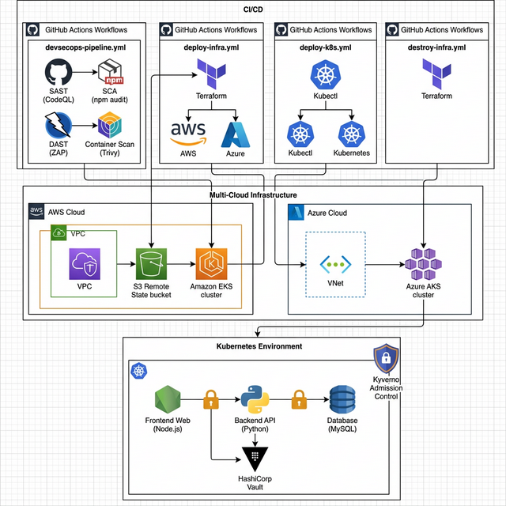

# DevSecOps Capstone Project: Secured Cloud-Native Architecture

This repository showcases a fully realized, **Hardened DevSecOps Cloud-Native Application**. Originally intentionally insecure for learning purposes, this project has been systematically fortified across every layer—from the source code up to the multi-cloud infrastructure—using industry benchmark DevSecOps practices.

## 🏛️ Architecture & Workflow Overview

This diagram represents the hardened, production-ready state of the project, driven by GitHub Actions continuous integration and continuous deployment pipelines:



### The Application Stack
The application is a secured microservice-based architecture:
*   **Frontend**: Node.js/Express application running on a hardened Google Distroless base image.
*   **Backend**: Python/Flask API running on a hardened Google Distroless base image.
*   **Database**: MySQL database protected behind Kubernetes Zero-Trust network policies and fetching credentials dynamically.

## 🚀 GitHub Actions Workflows (Automated Ops)

This repository is powered by four highly-detailed CI/CD pipelines found in `.github/workflows/`:

1.  **`devsecops-pipeline.yml`**: The Continuous Integration pipeline. Triggers on every push. It runs a gauntlet of security gates including:
    *   **SAST**: CodeQL and Bandit for static analysis.
    *   **SCA**: `npm audit` and `pip-audit` to catch vulnerable dependencies.
    *   **IaC and Container Scanning**: Trivy scans both the Terraform files and the built Docker images.
    *   **DAST**: OWASP ZAP Baseline scan fired against a spun-up local compose stack.
2.  **`deploy-infra.yml`**: Uses Terraform to provision the foundational Multi-Cloud Infrastructure in both AWS (VPC, EKS) and Azure (VNet, AKS). State is securely managed in a remote S3 backend, and dynamic secrets are fetched via HashiCorp Vault.
3.  **`deploy-k8s.yml`**: Automates `kubectl apply` commands to safely deploy the application microservices, Kyverno Admission Controllers, and strict Network Policies into the freshly minted clusters.
4.  **`destroy-infra.yml`**: A teardown workflow providing one-click infrastructure destruction via Terraform to avoid runaway cloud costs.

## 📂 Project Folder Structure

```text
.
├── .github/workflows/   # CI/CD GitHub Actions pipelines
├── backend/             # Python Flask API source code & hardened Dockerfile
├── frontend/            # Node.js Express source code & hardened Dockerfile
├── infra/               # Terraform Infrastructure-as-Code (IaC)
│   ├── aws/             # AWS VPC, EKS, IAM, and AWS Config definitions
│   └── azure/           # Azure VNet, AKS, and Identity definitions
├── k8s/                 # Kubernetes Manifests
│   ├── policies/        # Kyverno Admission Control cluster policies
│   ├── frontend.yaml    # Node.js deployment definitions
│   ├── backend.yaml     # Python deployment definitions
│   ├── database.yaml    # MySQL deployment definitions
│   └── network-policy.yaml # Zero-Trust internal firewalls
└── architecture.png     # Systems blueprint
```

## 🛡️ Applied Security Layers

The following security hardening and DevSecOps mitigations have been implemented throughout the codebase:

### 1. Identity & Access Security
*   Applied the Principle of Least Privilege across AWS IAM roles and Azure Managed Identities.
*   Integrated **HashiCorp Vault** to remove hardcoded credentials, injecting passwords securely into Kubernetes Pods.

### 2. Network Security Architecture
*   **Cloud Level**: Implemented a segmented 3-tier VPC architecture in AWS and restricted VNets in Azure. Strict Security Groups reject all default inbound traffic.
*   **Kubernetes Level**: Created a **Zero-Trust Network Policy** mapping enforcing a default-deny ingress/egress rule, only allowing the Frontend pod to talk to the Backend pod on port 5000, and the Backend pod to talk to the DB on port 3306.

### 3. Container Security & Runtime Protection
*   Refactored all Dockerfiles into Multi-Stage builds utilizing **Google Distroless** base images, drastically reducing the runtime attack surface by stripping out shells and package managers.
*   Applied strict `securityContexts` to Kubernetes Pods: enforcing `runAsNonRoot: true`, explicitly dropping `ALL` Linux kernel capabilities, and forcing a `readOnlyRootFilesystem`.

### 4. Dynamic Security Testing & Admission Control
*   **DAST Integration**: OWASP ZAP actively probes the application via the CI pipeline for runtime vulnerabilities.
*   **Kyverno Admission Controller**: Implemented cluster-wide policies that proactively reject any new workloads that request root execution, lack resource CPU/Memory limits, or pull images from untrusted registries.

### 5. Continuous Compliance
*   Enabled **AWS Config** to continuously monitor and record infrastructure changes against established compliance benchmarks.
*   Integrated **pre-commit hooks** locally (utilizing `trivy`, formatters, and secret-detectors) to prevent developers from checking in insecure code or plain-text secrets.

---

*This capstone project demonstrates the successful transformation from a highly vulnerable standalone application into a fully orchestrated, locked-down, and pipeline-driven multi-cloud DevSecOps environment.*
